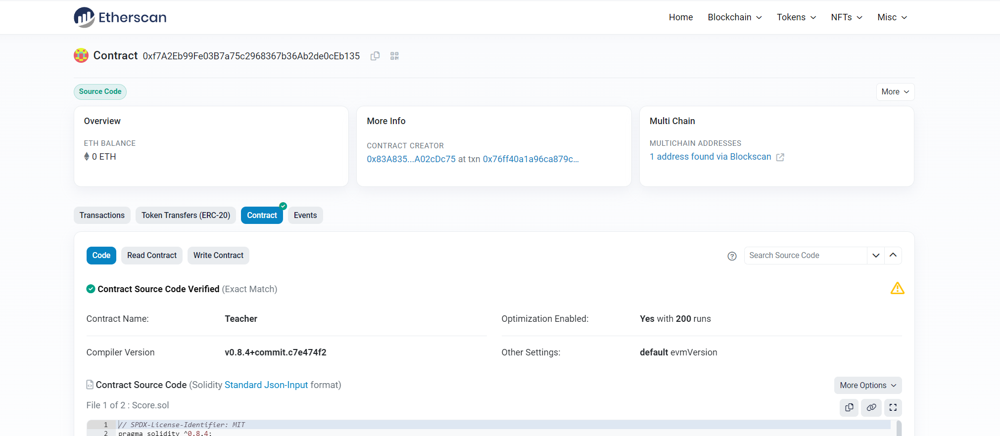
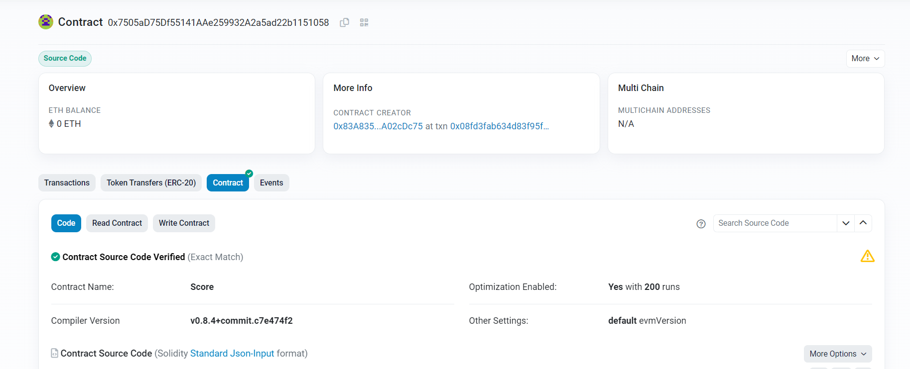
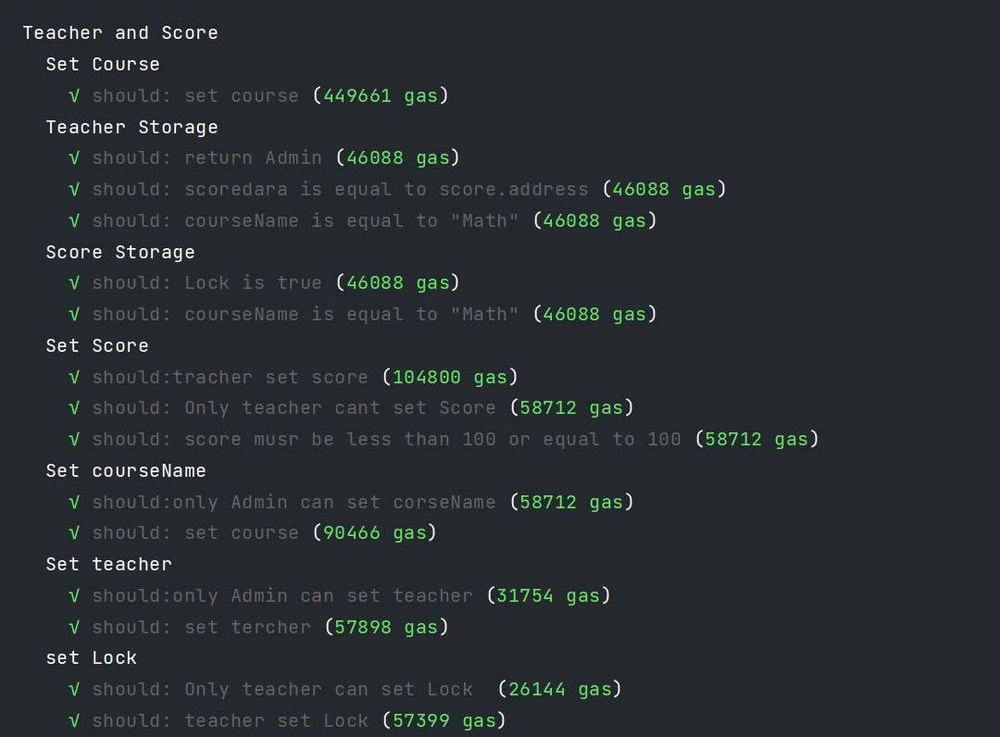
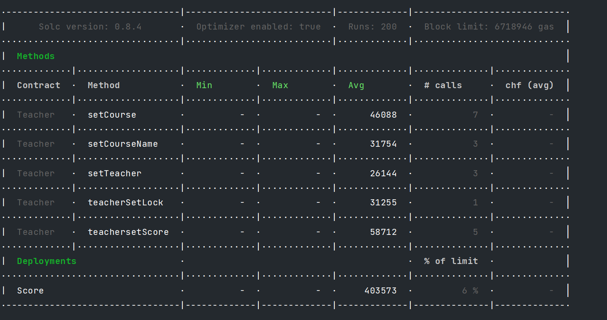

# Week2-2

---
## 合约代码
### Teacher.sol

```solidity

// SPDX-License-Identifier: MIT
pragma solidity ^0.8.4;

import "./Score.sol";

contract Teacher {
    //设置老师合约部署事件
    event Deployed(address indexed teach,string indexed course,address indexed admin);
    //设置管理员
    address public Admin;
    //定义错误
    error OnlyTeach();
    error OnlyAdmin();
    //设置老师
    address public teacher;
    //score合约
    Score public scoredata;
    //课程名字
    string public courseName = "Math";
    //构造函数
    constructor(address teach){
        Admin = msg.sender;
        teacher = teach;
        emit Deployed(teacher,courseName,Admin);
    }
    //设置课程
    function setCourse(address scoreadd) public onlyAdmin {
        scoredata = Score(scoreadd);
    }
    //设置学生成绩
    function teachersetScore(address stu,uint8 sc) public onlyTeacher returns(bool)  {
        bool result = scoredata.setScore(stu,sc);
        require(result,"ERR: SetScore Error");
        return result;
    }
    //设置查询锁
    function teacherSetLock(bool code) public onlyTeacher  {
        scoredata.setLock(code);
    }
    //更换老师
    function setTeacher(address teach) public onlyAdmin  {
        teacher = teach;
    }
    //更换课程名字
    function setCourseName(string calldata cour) public onlyAdmin  {
        courseName = cour;
    }
    modifier onlyTeacher {
        if (msg.sender != teacher) {
            revert OnlyTeach();
        }
        _;
    }
    modifier onlyAdmin {
        if (msg.sender != Admin) {
            revert OnlyAdmin();
        }
        _;
    }
}

```

### Score.sol

```solidity

// SPDX-License-Identifier: MIT
pragma solidity ^0.8.4;

contract Score {

    //定义事件
    event Deployed(address indexed teach,string indexed course);
    event SetScore(address indexed teach,address indexed stu,string indexed course);
    //学生分数
    mapping(address => uint8) scores;
    //Error 定义
    error OwnerErr();
    error ScoreErr();
    //管理员:教师
    address public Admin;
    //课程名字
    string public courseName = "Math";
    //查询成绩锁
    bool public Lock = true;
    //构造函数
    constructor(address teach){
        Admin = teach;
        emit Deployed(Admin,courseName);
    }
    //设置成绩
    function setScore(address stu,uint8 sc) public onlyAdmin verifyScore(sc) returns(bool) {
        scores[stu] = sc;
        emit SetScore(Admin,stu,courseName);
        return true;
    }
    //查询成绩
    function getScore() public view returns(uint8 sc) {
        require(Lock,"ERR: Not allow to get Score");
        sc = scores[msg.sender];
    }
    //设计查询锁
    function setLock(bool bl) public onlyAdmin {
        Lock = bl;
    }
    modifier onlyAdmin {
        if (Admin != msg.sender) {
            revert OwnerErr();
        }
        _;
    }
    modifier verifyScore(uint8 num) {
        if (num > 100) {
            revert ScoreErr();
        }
        _;
    }
}

```

---

## 编译合约

```js
npx hardhat compile
```
## 部署合约

### 部署合约代码

```js

const {ethers} = require("hardhat")
const fs = require("fs");

async function main() {
    let Admin;
    let teacher;
    let student;
    let teach;
    let score
    [Admin,teacher,student] = await ethers.getSigners();
    const Teach = await ethers.getContractFactory("Teacher");
    const Score = await ethers.getContractFactory("Score");
    teach= await Teach.deploy(teacher.address);
    await teach.deployed();
    setTimeout(async function () {
        score = await Score.deploy(teach.address);
        await score.deployed();
    },4000)

    setTimeout(async function () {
        let resp = await teach.connect(Admin).setCourse(score.address);
        resp.wait().then((data) =>{
            console.log(data.status);
            console.log(`Teacher contract: ${teach.address}`)
            console.log(`score contract: ${score.address}`)
        })
    },10000)

    setTimeout(function () {
        try {
            fs.readFile("././address.json","utf8",(err,data) => {
                if (err) {
                    throw err
                }
                addressData = JSON.parse(data)
                let len = Object.keys(addressData).length
                let dict = new Object()
                dict[`Teacher:`] = teach.address;
                dict[`Score:`] = score.address;
                addressData[`${len}`] = dict;
                fs.writeFile('././address.json',JSON.stringify(addressData),(err) => {
                    if (err) {
                        throw err
                    }
                    console.log("地址写入成功")
                })
            })
        } catch (err) {
            console.log(err.message)
        }
    },10000)

}

main().catch((err) =>{
    console.log(err);
    process.exitCode = 1;
})

```
### 部署命令
```js
npx hardhat run scripts/Teacher.js
```
### 部署地址

* [Teacher deployed](https://sepolia.etherscan.io/address/0xf7A2Eb99Fe03B7a75c2968367b36Ab2de0cEb135)
* 
* [Score deployed](https://sepolia.etherscan.io/address/0x7505aD75Df55141AAe259932A2a5ad22b1151058)
* 

---

## 测试合约

### 测试合约代码

```js
const { ethers } = require("hardhat")
const {expect} = require("chai")
const {applyProviderWrappers} = require("hardhat/internal/core/providers/construction");
const {extendConfig} = require("hardhat/config");

describe("Teacher and Score",function () {
    let Admin;
    let teacher;
    let student;
    let teach;
    let score;
    let Score;
    let Teach;

    async function init() {
        [Admin,teacher,student] = await ethers.getSigners();
        Teach = await ethers.getContractFactory("Teacher");
        Score = await ethers.getContractFactory("Score");
        teach= await Teach.deploy(teacher.address);
        await teach.deployed()
    }
    before(async function () {
        await init();
    })
    describe("Set Course",function () {
        before(async function() {
            score = await Score.deploy(teach.address);
            await score.deployed();
        })
        it('should: set course', async function () {
            let resp = await teach.connect(Admin).setCourse(await score.address);
            await resp.wait()
            let addr = await teach.scoredata();
            expect(addr).to.be.equal(score.address);
        });
    })
    describe("Teacher Storage",function () {
        it('should: return Admin', async function () {
            let result = await teach.teacher();
            expect(result).to.be.equal(teacher.address);
        });
        it('should: scoredara is equal to score.address', async function () {
            let result = await teach.scoredata();
            expect(result).to.be.equal(score.address);
        });
        it('should: courseName is equal to "Math"', async function () {
            let result = await teach.courseName();
            expect(result).to.be.equal("Math");
        });
    });
    describe("Score Storage",function () {
        it('should: Lock is true', async function () {
            let result = await score.Lock();
            expect(result).to.be.equal(true);
        });
        it('should: courseName is equal to "Math"', async function () {
            let result = await teach.courseName();
            expect(result).to.be.equal("Math");
        });
    });
    describe("Set Score",function () {
        it('should:tracher set score', async function () {
            await teach.connect(teacher).teachersetScore(student.address,50);
            let result = await score.connect(student).getScore();
            expect(result).to.be.equal(50);
        });
        it('should: Only teacher cant set Score', async function () {
            await expect(teach.connect(student).teachersetScore(teacher.address,50)).to.
            be.revertedWithCustomError(teach,"OnlyTeach");
        });
        it('should: score musr be less than 100 or equal to 100', async function () {
            await expect(teach.connect(teacher).teachersetScore(student.address,101)).
            to.be.revertedWithCustomError(score,"ScoreErr");
        });
    });
    describe("Set courseName",function () {
        it('should:only Admin can set corseName', async function () {
            await expect(teach.connect(teacher).setCourseName("Physical")).
            to.be.revertedWithCustomError(teach,"OnlyAdmin");
        });
        it('should: set course', async function () {
            await teach.connect(Admin).setCourseName("Physical");
            let result = await teach.courseName();
            expect(result).to.be.equal("Physical");
        });
    });
    describe("Set teacher",function () {
        it('should:only Admin can set teacher', async function () {
            await expect(teach.connect(teacher).setTeacher(teacher.address)).
            to.be.revertedWithCustomError(teach,"OnlyAdmin");
        });
        it('should: set tercher', async function () {
            await teach.connect(Admin).setTeacher(teacher.address);
            let result = await teach.teacher();
            expect(result).to.be.equal(teacher.address);
        });
    });
    describe("set Lock",function () {
        it('should: Only teacher can set Lock ', async function () {
            await expect(teach.connect(Admin).teacherSetLock(false)).to.be.revertedWithCustomError(teach,"OnlyTeach");
        });
        it('should: teacher set Lock', async function () {
            await teach.connect(teacher).teacherSetLock(false);
            await expect(score.connect(student).getScore()).to.be.revertedWith("ERR: Not allow to get Score");
        });
    })
})

```

### 使用Gas-reporter插件

```js
//在hardhat.config.js中引入插件
require(""hardhat-gas-reporter"")
//配置插件
gasReporter: {
    currency: 'CHF',
        gasPrice: 21
}
//在webstorm中开启插件,Powershell命令
$env:REPORT_GAS="true"
```

### 测试结果

* 
* 

#### Gas Report

* 