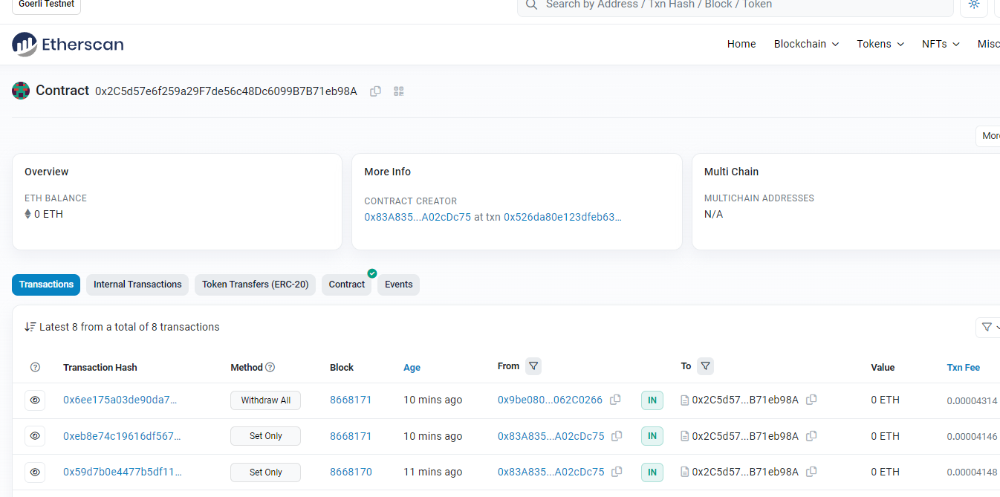
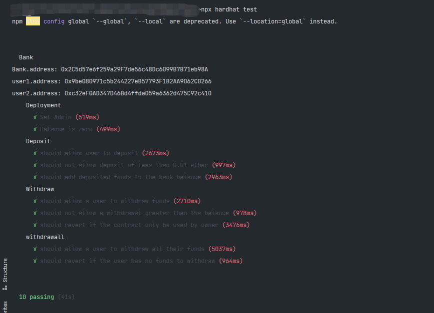

# w2-1

---

## Bank.sol

---

```solidity
// SPDX-License-Identifier: MIT
pragma solidity ^0.8.0;

contract Bank {
    //管理员
    address payable public admin;
    //记录余额
    mapping(address => uint) public balances;
    //重入锁
    bool public Lock = true;
    //admin 锁
    bool public only = true;
    //初始化
    constructor(){
        admin = payable(msg.sender);
    }
    //存款
    function Deposit() public payable safeLock {
        //检查message中携带的wei是否符合要求
        require(msg.value > 1e16,"Err: value must be greater than 0.01 ether.");
        //0.8以后自带溢出检查；
        balances[msg.sender] += msg.value;
    }
    //取部分
    function withdraw(uint amount) public safeLock {
        //检查余额
        require(balances[msg.sender] >= amount,"Err:Amount must be less than balance");
        //从账本减去取款
        balances[msg.sender] -= amount;
        //发送取款
        (bool result,) = msg.sender.call{value: amount}("");
        //判断转账是否成功
        require(result,"Err:Trandfer failure");
    }
    //取全部
    function withdrawAll() public safeLock  {
        //读取现有存款
        uint amount = balances[msg.sender];
        //判断存款是否为零
        require(amount > 0,"Err: balance must be greater than zero");
        //转账
        (bool result,) = msg.sender.call{value: amount}("");
        //判断转账是否成功
        require(result,"Err: Transfer failure");
        //余额归零
        delete balances[msg.sender];
    }
    //合约余额
    function bankBalance() public view returns(uint balance) {
        balance = address(this).balance;
    }
    //设置是否只有管理员可以存取款
    function setOnly(bool arg) public {
        require(admin == msg.sender,"Err: Only Admin");
        only = arg;
    }
    //函数修改器验证权限以及避免重入
    modifier safeLock() {
        if (only) {
            require(admin == msg.sender,"Err: Only Admin");
        }
        require(Lock,"Err:");
        Lock = false;
        _;
        Lock = true;
    }
    //收款函数
    receive() external payable {
        balances[msg.sender] += msg.value;
    }
    //不接受函数选择器错误的调用
    fallback() external {
        require(false,"Err: Selector is wrong.");
    }
}


```

## Deploy

---

```js
const hre = require("hardhat");
const fs = require("fs")

async function main() {
    const Bank = await hre.ethers.getContractFactory("Bank");
    const bank = await Bank.deploy();
    await  bank.deployed();
    let addressData;
    try {
        fs.readFile("././address.json","utf8",(err,data) => {
            if (err) {
                throw err
            }
            addressData = JSON.parse(data)
            let len = Object.keys(addressData).length
            addressData[[len]] = bank.address
            fs.writeFile('././address.json',JSON.stringify(addressData),(err) => {
                if (err) {
                    throw err
                }
                console.log("地址写入成功")
            })
        })
    } catch (err) {
        console.log(err.message)
    }
    console.log(`Deployed address: ${bank.address}`);
}

main().catch((error) => {
    console.error(error);
    process.exitCode = 1;
})
```

```
//编译合约
npx hardhat conpile
//验证合约
npx hardhat verify address <argument> --network goeri
```
* [Deployed Address: 0x2C5d57e6f259a29F7de56c48Dc6099B7B71eb98A](https://goerli.etherscan.io/address/0x2C5d57e6f259a29F7de56c48Dc6099B7B71eb98A)
* 

## test

---

```js
const {except} = require("chai");
const {ethers} = require("hardhat")

describe("Bank",function () {
    let bank;
    let owner;
    let user1;
    let user2;
    async function init() {
        [owner,user1,user2] = await ethers.getSigners();
        const Bank = await ethers.getContractFactory("Bank");
        bank = await Bank.deploy();
        await bank.deployed();

        console.log(`Bank.address: ${bank.address}`);
        console.log(`user1.address: ${user1.address}`);
        console.log(`user2.address: ${user2.address}`);
    }
    before(async function () {
        await init();
        await bank.connect(owner).setOnly(false);
    })
    describe("Deployment",function () {
        it("Set Admin",async function() {
            except(await bank.admin()).to.equal(owner.address);
        });
        it("Balance is zero",async function() {
            except(await bank.bankBalance()).to.equal(0)
        });
    });
    describe("Deposit",function () {
        it('should allow user to deposit', async function () {
            let init_balance = await bank.balances(user1.address);
            await bank.connect(user1).Deposit({value:ethers.utils.parseEther("0.02")});
            await setTimeout(async function () {
                except(await bank.balances(user1.address)).to.equal(init_balance.add(ethers.utils.parseEther("0.02")));
            },2000)

        });
        it('should not allow deposit of less than 0.01 ether', async function () {
            await except(bank.connect(user1).Deposit({value:ethers.utils.parseEther("0.005")})).to.be.revertedWith("Err: value must be greater than 0.01 ether.");
        });
        it('should add deposited funds to the bank balance', async function () {
            let init_balance = await bank.bankBalance();
            await bank.connect(user1).Deposit({value:ethers.utils.parseEther("0.02")});
            await setTimeout(async function () {
                except(await bank.bankBalance()).to.equal(init_balance.add(ethers.utils.parseEther("0.02")))
            },1000)
        });

    });
    describe("Withdraw",function (){
        it('should allow a user to withdraw funds', async function () {
            let init_balance = await bank.balances(user1.address);
            let amount = ethers.utils.parseEther("0.01")
            await bank.connect(user1).withdraw(amount);
            await setTimeout(async () => {
                except(await bank.balances(user1.address)).to.equal(init_balance.sub(amount));
            },2000)

        });
        it('should not allow a withdrawal greater than the balance', async function () {
            await except(bank.connect(user1).withdraw(ethers.utils.parseEther("5"))).to.be.revertedWith("Err:Amount must be less than balance");
        });
        it('should revert if the contract only be used by owner', async function () {
            await bank.connect(owner).setOnly(true);
            await except(bank.connect(user1).withdraw(10000)).to.be.revertedWith("Err: Only Admin");
        });
    })
    describe("withdrawall",function () {
        it('should allow a user to withdraw all their funds', async function () {
            await bank.connect(owner).setOnly(false);
            let initialBalance = await bank.balances(user1.address);
            await bank.connect(user1).withdrawAll();
            await setTimeout(async function () {
                except(await bank.balances(user1.address)).to.equal(ethers.BigNumber.from("0"));
            },2000)
        });
        it('should revert if the user has no funds to withdraw', async function () {
            await except(bank.connect(user2).withdrawAll()).to.be.revertedWith("Err: balance must be greater than zero");
        });
    })
})
```

```
npx hardhat test
```

* 
