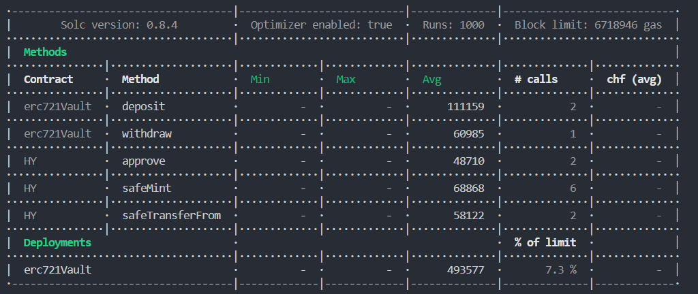

# Week3-1

---

## ERC20

---

### Contracts

#### ERC20

```solidity

// SPDX-License-Identifier: MIT
pragma solidity ^0.8.4;
import "@openzeppelin/contracts/token/ERC20/IERC20.sol";
import "@openzeppelin/contracts/security/Pausable.sol";
import "@openzeppelin/contracts/access/Ownable.sol";


contract DLToken is IERC20,Pausable,Ownable {

    uint8 Decimals = 18;
    uint Supply =1e25 ;
    string Symbol = "DL";
    string Name = "DLtoken";
    bool Lock = true;
    mapping(address => uint256) balances;
    mapping(address => mapping(address => uint)) allowances;

    constructor(){
        _mint(_msgSender(),Supply);
    }
    function name() public view returns(string memory) {
        return Name;
    }
    function symbol() public view returns(string memory) {
        return Symbol;
    }
    function decimals() public view returns(uint8) {
        return Decimals;
    }
    function totalSupply() public view override returns(uint) {
        return Supply;
    }
    function balanceOf(address account) public view override returns(uint) {
        return balances[account];
    }
    function allowance(address owner,address spender) public view override returns(uint) {
        return allowances[owner][spender];
    }
    function pause() public onlyOwner {
        _pause();
    }
    function unpause() public onlyOwner {
        _unpause();
    }
    function transfer(address to,uint256 amount) public override returns(bool) {
        address owner = _msgSender();
        _transferFrom(owner,to,amount);
        return true;
    }
    function transferFrom(address from,address to,uint256 amount) public override returns(bool) {
        address owner = _msgSender();
        _spendAllowance(from,owner,amount);
        _transferFrom(from,to,amount);
        return true;
    }
    function approve(address spender,uint256 amount) public override returns(bool) {
        address owner = _msgSender();
        _approve(owner,spender,amount);
        return true;
    }
    function burn( uint256 amount) public {
        address owner = _msgSender();
        _burn(owner,amount);
    }

    function _approve(address owner,address spender,uint amount) internal  {
        require(owner != address(0),"from is zero");
        require(spender != address(0),"to is zero");
        allowances[owner][spender] = amount;
        emit Approval(owner,spender,amount);
    }
    function _transferFrom(address from,address to,uint256 amount) internal {
        require(from != address(0),"from is zero");
        require(to != address(0),"to is zero");
        _beforeTokenTransfer(from,to,amount);
        uint fromBalance = balances[from];
        require(fromBalance >= amount, "ERC20: transfer amount exceeds balance");
        unchecked {
        balances[from] = fromBalance - amount;
        balances[to] += amount;
    }
        emit Transfer(from,to,amount);
        _afterTokenTransfer(from, to, amount);
    }

    function _spendAllowance(address owner,address spender,uint amount) internal{
        uint currentAllowance = allowance(owner,spender);
        if (currentAllowance != type(uint256).max) {
            require(currentAllowance >= amount,"ERC20: insufficient allowance");
            unchecked {
            _approve(owner,spender,currentAllowance-amount);
        }
        }
    }
    function _beforeTokenTransfer(
        address from,
        address to,
        uint256 amount
    ) internal whenNotPaused {}

    function _afterTokenTransfer(
        address from,
        address to,
        uint256 amount
    ) internal virtual {}

    function _burn(address from,uint amount) internal  {
        require(from != address(0),"ERC20: burn from the zero address");
        _beforeTokenTransfer(from,address(0),amount);
        uint currentBalance = balances[from];
        require(currentBalance >= amount,"ERC20: burn amount exceeds balance");
        unchecked {
        balances[from] = currentBalance - amount;
        Supply -= amount;
    }
        emit Transfer(from,address(0),amount);
        _afterTokenTransfer(from,address(0),amount);
    }

    function _mint(address to,uint amount) internal {
        require(Lock,"only constructor");
        require(to != address(0),"ERC20: mint to the zero address");
        balances[to] += amount;
        emit Transfer(address(0),to,amount);
        Lock = false;
    }
}


```

#### ERC20Vault

```solidity

// SPDX-License-Identifier: UNLICENSED
pragma solidity ^0.8.4;

import "@openzeppelin/contracts/token/ERC20/IERC20.sol";

contract Vault {
    IERC20 Token;
    mapping(address => uint) public balances;
    constructor(address addr) {
        Token = IERC20(addr);
    }
    function deposit(uint amount) public {
        address dp = address(this);
        uint allow = Token.allowance(msg.sender,dp);
        require(allow >= amount,"ERC:Allowance must greater than amount");
        uint currentBalance = Token.balanceOf(dp);
        Token.transferFrom(msg.sender,dp,amount);
        uint newBalance = Token.balanceOf(dp);
        balances[msg.sender] += amount;
        require(newBalance == currentBalance+amount,"ERC:Error");
    }
    function withdraw(uint amount) public {
        uint bal = balances[msg.sender];
        require(bal >= amount,"ERC:Balance can`t less than amount");
        Token.transfer(msg.sender,amount);
        balances[msg.sender] -= amount;
    }
}


```

### Deploy

#### Compile

```javascript

npx hardhat compile

```

#### Deploy

```javascript

const hre = require("hardhat");
const fs = require("fs");

async function main() {
    let Admin;
    let user1;
    let user2;
    let DL;
    let Valut
    let dl;
    let vault;
    [Admin,user1,user2] = await hre.ethers.getSigners();
    DL = await hre.ethers.getContractFactory("DLToken");
    Valut = await hre.ethers.getContractFactory("Vault")
    dl = await DL.deploy();
    dl.deployed().then(async function (data) {
        vault = await Valut.deploy(data.address);
        await vault.deployed()
    })
    setTimeout(function () {
        try {
            fs.readFile("././address.json","utf8",(err,data) => {
                if (err) {
                    throw err
                }
                addressData = JSON.parse(data)
                let len = Object.keys(addressData).length
                let dict = new Object()
                dict[`DLToken:`] = dl.address;
                dict[`Vault:`] = vault.address;
                addressData[`${len}`] = dict;
                fs.writeFile('././address.json',JSON.stringify(addressData),(err) => {
                    if (err) {
                        throw err
                    }
                    console.log("地址写入成功")
                })
            })
        } catch (err) {
            console.log(err.message)
        }
    },18000)
    setTimeout(function () {
        console.log("DL:"+dl.address)
        console.log("vault:"+vault.address)
    },18000)
}
main().catch((err) => {
    console.log(err);
})

```

```javascript

npx hardhat run scripts/deploycode.js

```

#### Deployed

* [ERC20 Deployed address](https://sepolia.etherscan.io/token/0x11e39e20e0215e258f104e7cf4e9a9f956167aa5)
* [ERC20Vault Deployed address](https://sepolia.etherscan.io/address/0x03b32dbc5b29181c985259bee47dfb834b5840ca)


### Test


#### ERC20Test.js

```javascript

const { ethers } = require("hardhat");
const { expect } = require('chai');
const hre = require("hardhat");
const {extendConfig} = require("hardhat/config");
const {applyProviderWrappers} = require("hardhat/internal/core/providers/construction");

describe("Week3-1",function () {
    let Admin;
    let user1;
    let user2;
    let DL;
    let Valut;
    let dl;
    let vault;
    async function init() {
        [Admin,user1,user2] = await hre.ethers.getSigners();
        DL = await hre.ethers.getContractFactory("DLToken");
        Valut = await hre.ethers.getContractFactory("Vault");
        dl = await DL.deploy();
        await dl.deployed();
    }
    before(async function() {
        await init();
    })
    describe("deploy Vault",function () {
        before(async function() {
            vault = await Valut.deploy(dl.address);
            await vault.deployed()
        })
        it('should:Balance is zero', async function () {
            let AdminBalance = await vault.balances(Admin.address)
            expect(AdminBalance).to.be.equal(0);
        });
    })
    describe("DLToken",function () {
        it('should:Balance od Admin is 1*10**25', async function () {
            let balance = await dl.balanceOf(Admin.address);
            expect(balance).to.be.equal(ethers.BigNumber.from("10000000000000000000000000"));
        });
        it('should: transfer', async function () {
            await dl.connect(Admin).transfer(user1.address,ethers.BigNumber.from("10000000000000000000000"));
            let result = await dl.balanceOf(user1.address)
            expect(result).to.be.equal(ethers.BigNumber.from("10000000000000000000000"));
        });
        it('should: approve', async function () {
            await dl.connect(Admin).approve(user1.address,ethers.BigNumber.from("10000000000000000000000"));
            let result = await dl.allowance(Admin.address,user1.address);
            expect(result).to.be.equal(ethers.BigNumber.from("10000000000000000000000"));
        });
        it('should: transferFrom', async function () {
            await dl.connect(user1).transferFrom(Admin.address,user2.address,ethers.BigNumber.from("10000000000000000000000"));
            let result = await dl.balanceOf(user2.address);
            expect(result).to.be.equal(ethers.BigNumber.from("10000000000000000000000"));
        });
        it('should: paused return false', async function () {
            let result = await dl.paused();
            expect(result).to.be.equal(false)
        });
        it('should: only Admin can paused', async function () {
            await expect(dl.connect(user1).pause()).to.be.revertedWith("Ownable: caller is not the owner")
        });
        it('should: Admin', async function () {
            await dl.connect(Admin).pause();
            await expect(dl.connect(Admin).transfer(user1.address,ethers.BigNumber.from("10000000000000000000000"))).to.be.revertedWith("Pausable: paused");

        });
        it('should: unpaused', async function () {
            await dl.connect(Admin).unpause();
            let oldresult = await dl.allowance(Admin.address,user1.address);
            await dl.connect(Admin).approve(user1.address,ethers.BigNumber.from("10000000000000000000000"));
            let result = await dl.allowance(Admin.address,user1.address);
            expect(result).to.be.equal(ethers.BigNumber.from("10000000000000000000000").add(oldresult));
        });
        it('should: burn other account', async function () {
            let oldresult = await dl.balanceOf(user1.address);
            await dl.connect(user1).burn(ethers.BigNumber.from("10000000000000000000000"))
            let result = await dl.balanceOf(user1.address);
            expect(result).to.be.equal(oldresult.sub(ethers.BigNumber.from("10000000000000000000000")));
        });
        it('should: revert when burn token greater than balance', async function () {
            await expect(dl.connect(user1).burn(ethers.BigNumber.from("10"),{gasLimit:2000000})).to.be.revertedWith('ERC20: burn amount exceeds balance')
        });
    })
    describe("Vault",function () {
        it('should: must be approval ', async function () {
            await dl.connect(Admin).transfer(user1.address,ethers.BigNumber.from("10000000000000000000000"))
            await expect(vault.connect(user1).deposit(ethers.BigNumber.from("100000000"))).to.be.revertedWith("ERC:Allowance must greater than amount");
        });
        it('should: remeber deposit', async function () {
            let result = await dl.balanceOf(user1.address);
            await dl.connect(user1).approve(vault.address,result);
            await vault.connect(user1).deposit(ethers.BigNumber.from("10000"));
            let bal = await vault.balances(user1.address);
            expect(bal).to.be.equal(ethers.BigNumber.from("10000"))
        });
        it('should: balanceOf(vault)-1', async function () {
            let result = await dl.balanceOf(vault.address);
            expect(result).to.be.equal(ethers.BigNumber.from("10000"));
        });
        it('should: withdraw', async function () {
            let bal = await vault.balances(user1.address);
            await vault.connect(user1).withdraw(ethers.BigNumber.from("5000"));
            let bal2 = await vault.balances(user1.address);
            expect(bal2).to.be.equal(bal.sub(ethers.BigNumber.from("5000")));
        });
        it('should: balanceOf(vault)-2', async function () {
            let result = await dl.balanceOf(vault.address);
            expect(result).to.be.equal(ethers.BigNumber.from("5000"));
        });
    })
})

```

#### Result

* 
* 
* 

---

## ERC721

---

### Contracts

#### ERC721

```solidity

// SPDX-License-Identifier: UNLICENSED
pragma solidity ^0.8.4;

import "@openzeppelin/contracts/token/ERC721/IERC721.sol";
import "@openzeppelin/contracts/token/ERC721/IERC721Receiver.sol";
import "@openzeppelin/contracts/token/ERC721/extensions/IERC721Metadata.sol";
import "@openzeppelin/contracts/utils/Address.sol";
import "@openzeppelin/contracts/utils/Context.sol";
import "@openzeppelin/contracts/utils/introspection/ERC165.sol";
import "@openzeppelin/contracts/utils/Strings.sol";


contract HY is Context,ERC165,IERC721,IERC721Metadata {
    using Address for address;
    using Strings for uint256;

    string private _name = "HY";
    string private _symbol = "YY";
    string private _url = "https://ipfs.filebase.io/ipfs/QmRRoY8THrozvyVuvbkg8f234XRHBhybyVQ4Ax3LnZxhoD/";

    mapping(uint => address) private _owners;
    mapping(address => uint) private _balances;
    mapping(uint => address) private _tokenApprovals;
    mapping(address => mapping(address => bool)) private _operatorApprovals;

    constructor(){}

    function supportsInterface(bytes4 interfaceId) public view override(ERC165,IERC165)  returns(bool) {
        return interfaceId == type(IERC721).interfaceId || interfaceId == type(IERC721Metadata).interfaceId || super.supportsInterface(interfaceId);
    }

    function balanceOf(address owner) public view override returns(uint) {
        require(owner != address(0),"ERC721:address zero is a invalid owner");
        return _balances[owner];
    }

    function ownerOf(uint256 tokenId) public view override returns(address)  {
        address owner = _ownerOf(tokenId);
        require(owner != address(0),"ERC721:invalid tokenId");
        return owner;
    }

    function name() public view override returns(string memory) {
        return _name;
    }

    function symbol() public view override returns(string memory) {
        return _symbol;
    }

    function tokenURI(uint256 tokenId) public view override returns(string memory) {
        _requireMinted(tokenId);
        string memory baseUrl = _baseUrl();
        return bytes(baseUrl).length > 0 ? string(abi.encodePacked(baseUrl,tokenId.toString())) : "";
    }

    function _baseUrl() internal view returns(string memory) {
        return _url;
    }

    function approve(address to,uint256 tokenId) public override {
        address owner = ownerOf(tokenId);
        require(to != owner,"ERC721:approval to current owner");
        require(
            owner == _msgSender() || isApprovedForAll(owner,_msgSender()),
            "ERC721: approve caller is not token owner or approved for all"
        );
        _approve(to, tokenId);
    }

    function getApproved(uint tokenId) public view override returns(address) {
        _requireMinted(tokenId);
        return _tokenApprovals[tokenId];
    }

    function setApprovalForAll(address operator,bool approved) public override  {
        _setApprovalForAll(_msgSender(),operator,approved);
    }

    function isApprovedForAll(address owner,address operator) public view override returns(bool) {
        return _operatorApprovals[owner][operator];
    }

    function transferFrom(address from,address to,uint tokenId) public override {
        require(_isApprovedOrOwner(_msgSender(),tokenId),"ERC721: caller is not token owner or approved");
        _transfer(from,to,tokenId);
    }
    function safeTransferFrom(
        address from,
        address to,
        uint256 tokenId
    ) public virtual override {
        safeTransferFrom(from, to, tokenId, "");
    }
    function safeTransferFrom(
        address from,
        address to,
        uint256 tokenId,
        bytes memory data
    ) public virtual override {
        require(_isApprovedOrOwner(_msgSender(), tokenId), "ERC721: caller is not token owner or approved");
        _safeTransfer(from, to, tokenId, data);
    }

    function _safeTransfer(
        address from,
        address to,
        uint256 tokenId,
        bytes memory data
    ) internal virtual {
        _transfer(from, to, tokenId);
        require(_checkOnERC721Received(from, to, tokenId, data), "ERC721: transfer to non ERC721Receiver implementer");
    }
    function _ownerOf(uint256 tokenId) internal view virtual returns (address) {
        return _owners[tokenId];
    }
    function _exists(uint256 tokenId) internal view virtual returns (bool) {
        return _ownerOf(tokenId) != address(0);
    }
    function _isApprovedOrOwner(address spender, uint256 tokenId) internal view virtual returns (bool) {
        address owner = ownerOf(tokenId);
        return (spender == owner || isApprovedForAll(owner, spender) || getApproved(tokenId) == spender);
    }
    function safeMint(uint tokenId) public returns(bool) {
        _safeMint(_msgSender(),tokenId);
        address addr = _ownerOf(tokenId);
        require(_msgSender() == addr);
        return true;
    }
    function _safeMint(address to, uint256 tokenId) internal virtual {
        _safeMint(to, tokenId, "");
    }
    function _safeMint(
        address to,
        uint256 tokenId,
        bytes memory data
    ) internal virtual {
        _mint(to, tokenId);
        require(
            _checkOnERC721Received(address(0), to, tokenId, data),
            "ERC721: transfer to non ERC721Receiver implementer"
        );
    }
    function _mint(address to, uint256 tokenId) internal virtual {
        require(to != address(0), "ERC721: mint to the zero address");
        require(!_exists(tokenId), "ERC721: token already minted");
        _beforeTokenTransfer(address(0), to, tokenId, 1);
        require(!_exists(tokenId), "ERC721: token already minted");
        unchecked {
            _balances[to] += 1;
        }
        _owners[tokenId] = to;
        emit Transfer(address(0), to, tokenId);
        _afterTokenTransfer(address(0), to, tokenId, 1);
    }
    function _burn(uint256 tokenId) internal virtual {
        address owner = ownerOf(tokenId);
        _beforeTokenTransfer(owner, address(0), tokenId, 1);
        owner = ownerOf(tokenId);
        // Clear approvals
        delete _tokenApprovals[tokenId];
        unchecked {
            _balances[owner] -= 1;
        }
        delete _owners[tokenId];
        emit Transfer(owner, address(0), tokenId);
        _afterTokenTransfer(owner, address(0), tokenId, 1);
    }
    function _transfer(
        address from,
        address to,
        uint256 tokenId
    ) internal virtual {
        require(ownerOf(tokenId) == from, "ERC721: transfer from incorrect owner");
        require(to != address(0), "ERC721: transfer to the zero address");
        _beforeTokenTransfer(from, to, tokenId, 1);
        require(ownerOf(tokenId) == from, "ERC721: transfer from incorrect owner");
        delete _tokenApprovals[tokenId];
        unchecked {
            _balances[from] -= 1;
            _balances[to] += 1;
        }
        _owners[tokenId] = to;
        emit Transfer(from, to, tokenId);
        _afterTokenTransfer(from, to, tokenId, 1);
    }
    function _approve(address to, uint256 tokenId) internal virtual {
        _tokenApprovals[tokenId] = to;
        emit Approval(ownerOf(tokenId), to, tokenId);
    }
    function _setApprovalForAll(
        address owner,
        address operator,
        bool approved
    ) internal virtual {
        require(owner != operator, "ERC721: approve to caller");
        _operatorApprovals[owner][operator] = approved;
        emit ApprovalForAll(owner, operator, approved);
    }
    function _requireMinted(uint256 tokenId) internal view virtual {
        require(_exists(tokenId), "ERC721: invalid token ID");
    }
    function _beforeTokenTransfer(
        address from,
        address to,
        uint256 firstTokenId,
        uint256 batchSize
    ) internal virtual {}
    function _afterTokenTransfer(
        address from,
        address to,
        uint256 firstTokenId,
        uint256 batchSize
    ) internal virtual {}
    function __unsafe_increaseBalance(address account, uint256 amount) internal {
        _balances[account] += amount;
    }
    function _checkOnERC721Received(
        address from,
        address to,
        uint256 tokenId,
        bytes memory data
    ) private returns (bool) {
        if (to.isContract()) {
            try IERC721Receiver(to).onERC721Received(_msgSender(), from, tokenId, data) returns (bytes4 retval) {
                return retval == IERC721Receiver.onERC721Received.selector;
            } catch (bytes memory reason) {
                if (reason.length == 0) {
                    revert("ERC721: transfer to non ERC721Receiver implementer");
                } else {
                    assembly {
                        revert(add(32, reason), mload(reason))
                    }
                }
            }
        } else {
            return true;
        }
    }
}


```

#### ERC721Vault

```solidity

// SPDX-License-Identifier: UNLICENSED
pragma solidity ^0.8.4;

import "./HY.sol";
import "@openzeppelin/contracts/token/ERC721/IERC721Receiver.sol";

contract erc721Vault {
    HY public Token;
    mapping(uint => address) private _owner;
    mapping(address => uint) private _balances;
    constructor(address addr) {
        Token = HY(addr);
    }
    function deposit(uint tokenId) public {
        address dp = address(this);
        address allowAddr = Token.getApproved(tokenId);
        address tokenOwner = Token.ownerOf(tokenId);
        require(allowAddr == dp,"ERC:Tokn must apptoval to contract");
        require(msg.sender == tokenOwner,"ERC721: Ower is`t caller");
        Token.safeTransferFrom(msg.sender,dp,tokenId);
        address newTokenOwner = Token.ownerOf(tokenId);
        require(newTokenOwner == dp,"ERC:Tokn transfer error");
        _owner[tokenId] = msg.sender;
        _balances[msg.sender] += 1;
    }
    function withdraw(uint tokenId) public {
        address tokenOwner = _owner[tokenId];
        require(tokenOwner == msg.sender,"ERC721: Not tokn owner");
        Token.safeTransferFrom(address(this),msg.sender,tokenId);
        delete _owner[tokenId];
        _balances[msg.sender] -= 1;
    }
    function getBalance() public view returns(uint count) {
        address owner = msg.sender;
        count = _balances[owner];
        //return count;
    }

    function onERC721Received(
        address operator,
        address from,
        uint256 tokenId,
        bytes calldata data
    ) external pure returns (bytes4) {
        return IERC721Receiver.onERC721Received.selector;
    }
}


```

### Deploy


#### Compile


```javascript

npx hardhat compile

```

#### Deploy

```javascript

const hre = require("hardhat");
const fs = require("fs");


async function main() {
    let Admin;
    let user1;
    let user2;
    let ERC721;
    let ERC721Valut
    let erc721;
    let erc721vault;
    [Admin,user1,user2] = await hre.ethers.getSigners();
    ERC721 = await hre.ethers.getContractFactory("HY");
    ERC721Valut = await hre.ethers.getContractFactory("erc721Vault");
    erc721 = await  ERC721.deploy();
    erc721.deployed().then(async (data) => {
        erc721vault = await ERC721Valut.deploy(data.address);
        await erc721vault.deployed();
    })
    setTimeout(function () {
        try {
            fs.readFile("././address.json","utf8",(err,data) => {
                if (err) {
                    throw err
                }
                addressData = JSON.parse(data)
                let len = Object.keys(addressData).length
                let dict = new Object()
                dict[`ERC721 Token:`] = erc721.address;
                dict[`ERC721 vault:`] = erc721vault.address;
                addressData[`${len}`] = dict;
                fs.writeFile('././address.json',JSON.stringify(addressData),(err) => {
                    if (err) {
                        throw err
                    }
                    console.log("地址写入成功")
                })
            })
        } catch (err) {
            console.log(err.message)
        }
    },18000)
    setTimeout(function () {
        console.log("ERC721 Token:"+erc721.address)
        console.log("ERC721 vault:"+erc721vault.address)
    },18000)
}


main().catch((err) => {
    console.log(err);
    process.exitCode = 1;
})

```

### Deployed

* [ERC721](https://goerli.etherscan.io/address/0xc82b3fe59cbdfeff30fb5ff96c1277313d7e04e2)
* [ERC721Vault](https://goerli.etherscan.io/address/0xaa78a2a37d82c1a6836f158b672a89673c07e8cb)

#### Test

##### ERC721Test.js

```javascript

const { ethers} = require("hardhat");
const { expect } = require("chai");


describe("ERC721",function () {
    let Admin;
    let user1;
    let user2;
    let ERC721;
    let ERC721Valut;
    let erc721;
    let erc721vault;
    async function init() {
        [Admin,user1,user2] = await hre.ethers.getSigners();
        ERC721 = await ethers.getContractFactory("HY");
        ERC721Valut = await ethers.getContractFactory("erc721Vault")
        erc721 = await ERC721.deploy();
        await erc721.deployed();
    }
    before(async function () {
        await init();
    })

    describe("Deploy ERC721Vault",function () {
        before(async function init2() {
            erc721vault = await ERC721Valut.deploy(erc721.address);
            await erc721vault.deployed();
        })
        it('should: Token address is equal to erc721 address', async function () {
            let result = await erc721vault.Token();
            expect(result).to.be.equal(erc721.address);
        });
    });
    describe("ERC721",function () {
        it('should: name', async function () {
            let result = await erc721.name();
            expect(result).to.be.equal("HY")
        });
        it('should: symbol', async function () {
            let result = await erc721.symbol();
            expect(result).to.be.equal("YY")
        });
        it('should: mint', async function () {
            await erc721.connect(Admin).safeMint(1);
            let result = await erc721.ownerOf(1);
            expect(result).to.be.equal(Admin.address)
        });
        it('should: balanceOf', async function () {
            let result = await erc721.balanceOf(Admin.address);
            expect(result).to.be.equal(1);
        });
        it('should: tokenURI', async function () {
            let result = await erc721.tokenURI(1);
            expect(result).to.be.equal("https://ipfs.filebase.io/ipfs/QmRRoY8THrozvyVuvbkg8f234XRHBhybyVQ4Ax3LnZxhoD/1");

        });
        it('should: safeTransferFrom', async function () {
            await erc721.connect(Admin)["safeTransferFrom(address,address,uint256)"](Admin.address,user1.address,1);
            let result = await erc721.balanceOf(user1.address)
            expect(result).to.be.equal(1);
        });
    })
    describe("erc721Vault",function() {
        it('should: mint', async function () {
            await erc721.connect(Admin).safeMint(2);
            let result = await erc721.ownerOf(2);
            expect(result).to.be.equal(Admin.address)
        });
        it("should: Approve", async function() {
            await erc721.connect(Admin).approve(erc721vault.address,2);
            let result = await erc721.getApproved(2);
            expect(result).to.be.equal(erc721vault.address);
        })
        it("should: Deny", async function() {
            await erc721vault.connect(Admin).deposit(2);
            let result = await erc721vault.connect(Admin).getBalance();
            expect(result).to.be.equal(1);
        })
        it("should: withdraw", async function() {
            await erc721vault.connect(Admin).withdraw(2)
            let result = await erc721.connect(Admin). balanceOf(Admin.address);
            expect(result).to.be.equal(1);
        })
    })

})

```

##### Result

* 
* 
* 