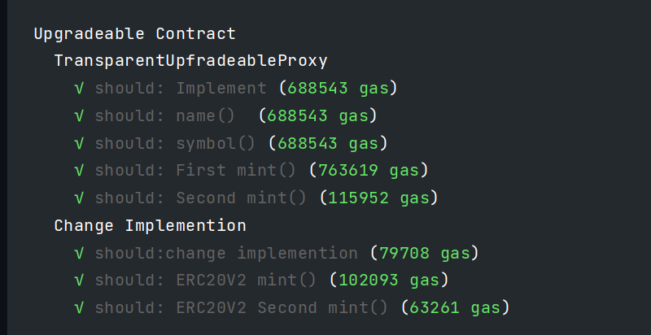
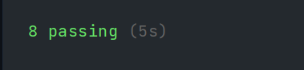
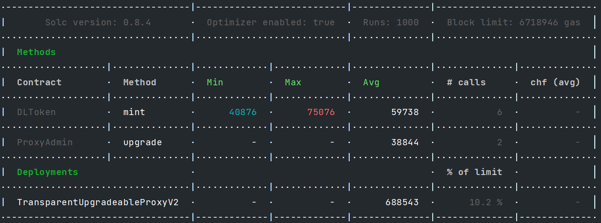

# Week3-2
## 使用Transparent_Proxy 可升级方案


---


### ProxyAdmin

```solidity
// SPDX-License-Identifier: MIT
// OpenZeppelin Contracts v4.4.1 (proxy/transparent/ProxyAdmin.sol)

pragma solidity ^0.8.0;

import "./TransparentUpgradeableProxy.sol";
import "@openzeppelin/contracts/access/Ownable.sol";

/**
 * @dev This is an auxiliary contract meant to be assigned as the admin of a {TransparentUpgradeableProxy}. For an
 * explanation of why you would want to use this see the documentation for {TransparentUpgradeableProxy}.
 */
contract ProxyAdmin is Ownable {
    /**
     * @dev Returns the current implementation of `proxy`.
     *
     * Requirements:
     *
     * - This contract must be the admin of `proxy`.
     */
    function getProxyImplementation(TransparentUpgradeableProxy proxy) public view virtual returns (address) {
        // We need to manually run the static call since the getter cannot be flagged as view
        // bytes4(keccak256("implementation()")) == 0x5c60da1b
        (bool success, bytes memory returndata) = address(proxy).staticcall(hex"5c60da1b");
        require(success);
        return abi.decode(returndata, (address));
    }

    /**
     * @dev Returns the current admin of `proxy`.
     *
     * Requirements:
     *
     * - This contract must be the admin of `proxy`.
     */
    function getProxyAdmin(TransparentUpgradeableProxy proxy) public view virtual returns (address) {
        // We need to manually run the static call since the getter cannot be flagged as view
        // bytes4(keccak256("admin()")) == 0xf851a440
        (bool success, bytes memory returndata) = address(proxy).staticcall(hex"f851a440");
        require(success);
        return abi.decode(returndata, (address));
    }

    /**
     * @dev Changes the admin of `proxy` to `newAdmin`.
     *
     * Requirements:
     *
     * - This contract must be the current admin of `proxy`.
     */
    function changeProxyAdmin(TransparentUpgradeableProxy proxy, address newAdmin) public virtual onlyOwner {
        proxy.changeAdmin(newAdmin);
    }

    /**
     * @dev Upgrades `proxy` to `implementation`. See {TransparentUpgradeableProxy-upgradeTo}.
     *
     * Requirements:
     *
     * - This contract must be the admin of `proxy`.
     */
    function upgrade(TransparentUpgradeableProxy proxy, address implementation) public virtual onlyOwner {
        proxy.upgradeTo(implementation);
    }

    /**
     * @dev Upgrades `proxy` to `implementation` and calls a function on the new implementation. See
     * {TransparentUpgradeableProxy-upgradeToAndCall}.
     *
     * Requirements:
     *
     * - This contract must be the admin of `proxy`.
     */
    function upgradeAndCall(
        TransparentUpgradeableProxy proxy,
        address implementation,
        bytes memory data
    ) public payable virtual onlyOwner {
        proxy.upgradeToAndCall{value: msg.value}(implementation, data);
    }
}

```

### TransparentUpgradeableProxy

```solidity
Week3-2
使用Transparent_Proxy 可升级方案
ProxyAdmin
// SPDX-License-Identifier: MIT
// OpenZeppelin Contracts v4.4.1 (proxy/transparent/ProxyAdmin.sol)

pragma solidity ^0.8.0;

import "./TransparentUpgradeableProxy.sol";
import "@openzeppelin/contracts/access/Ownable.sol";

/**
 * @dev This is an auxiliary contract meant to be assigned as the admin of a {TransparentUpgradeableProxy}. For an
 * explanation of why you would want to use this see the documentation for {TransparentUpgradeableProxy}.
 */
contract ProxyAdmin is Ownable {
    /**
     * @dev Returns the current implementation of `proxy`.
     *
     * Requirements:
     *
     * - This contract must be the admin of `proxy`.
     */
    function getProxyImplementation(TransparentUpgradeableProxy proxy) public view virtual returns (address) {
        // We need to manually run the static call since the getter cannot be flagged as view
        // bytes4(keccak256("implementation()")) == 0x5c60da1b
        (bool success, bytes memory returndata) = address(proxy).staticcall(hex"5c60da1b");
        require(success);
        return abi.decode(returndata, (address));
    }

    /**
     * @dev Returns the current admin of `proxy`.
     *
     * Requirements:
     *
     * - This contract must be the admin of `proxy`.
     */
    function getProxyAdmin(TransparentUpgradeableProxy proxy) public view virtual returns (address) {
        // We need to manually run the static call since the getter cannot be flagged as view
        // bytes4(keccak256("admin()")) == 0xf851a440
        (bool success, bytes memory returndata) = address(proxy).staticcall(hex"f851a440");
        require(success);
        return abi.decode(returndata, (address));
    }

    /**
     * @dev Changes the admin of `proxy` to `newAdmin`.
     *
     * Requirements:
     *
     * - This contract must be the current admin of `proxy`.
     */
    function changeProxyAdmin(TransparentUpgradeableProxy proxy, address newAdmin) public virtual onlyOwner {
        proxy.changeAdmin(newAdmin);
    }

    /**
     * @dev Upgrades `proxy` to `implementation`. See {TransparentUpgradeableProxy-upgradeTo}.
     *
     * Requirements:
     *
     * - This contract must be the admin of `proxy`.
     */
    function upgrade(TransparentUpgradeableProxy proxy, address implementation) public virtual onlyOwner {
        proxy.upgradeTo(implementation);
    }

    /**
     * @dev Upgrades `proxy` to `implementation` and calls a function on the new implementation. See
     * {TransparentUpgradeableProxy-upgradeToAndCall}.
     *
     * Requirements:
     *
     * - This contract must be the admin of `proxy`.
     */
    function upgradeAndCall(
        TransparentUpgradeableProxy proxy,
        address implementation,
        bytes memory data
    ) public payable virtual onlyOwner {
        proxy.upgradeToAndCall{value: msg.value}(implementation, data);
    }
}

TransparentUpgradeableProxy

```

### ERC20V1

```solidity
// SPDX-License-Identifier: MIT

pragma solidity ^0.8.0;

import "@openzeppelin/contracts-upgradeable/token/ERC20/IERC20Upgradeable.sol";
import "@openzeppelin/contracts-upgradeable/token/ERC20/extensions/IERC20MetadataUpgradeable.sol";
import "@openzeppelin/contracts-upgradeable/utils/ContextUpgradeable.sol";
import "@openzeppelin/contracts-upgradeable/proxy/utils/Initializable.sol";


contract ERC20Upgradeable is Initializable, ContextUpgradeable, IERC20Upgradeable, IERC20MetadataUpgradeable {
    mapping(address => uint256) private _balances;

    mapping(address => mapping(address => uint256)) private _allowances;

    uint256 private _totalSupply;

    string private _name;
    string private _symbol;
    uint256[45] private __gap;

    function initialize(string memory name_, string memory symbol_) public initializer {
        __ERC20_init_unchained(name_, symbol_);
    }

    function __ERC20_init_unchained(string memory name_, string memory symbol_) internal onlyInitializing {
        _name = name_;
        _symbol = symbol_;
    }
function name() public view virtual override returns (string memory) {
        return _name;
    }

    function symbol() public view virtual override returns (string memory) {
        return _symbol;
    }

    function decimals() public view virtual override returns (uint8) {
        return 18;
    }

    function totalSupply() public view virtual override returns (uint256) {
        return _totalSupply;
    }


    function balanceOf(address account) public view virtual override returns (uint256) {
        return _balances[account];
    }


    function transfer(address to, uint256 amount) public virtual override returns (bool) {
        address owner = _msgSender();
        _transfer(owner, to, amount);
        return true;
    }

    function allowance(address owner, address spender) public view virtual override returns (uint256) {
        return _allowances[owner][spender];
    }


    function approve(address spender, uint256 amount) public virtual override returns (bool) {
        address owner = _msgSender();
        _approve(owner, spender, amount);
        return true;
    }


    function transferFrom(
        address from,
        address to,
        uint256 amount
    ) public virtual override returns (bool) {
        address spender = _msgSender();
        _spendAllowance(from, spender, amount);
        _transfer(from, to, amount);
        return true;
    }


    function increaseAllowance(address spender, uint256 addedValue) public virtual returns (bool) {
        address owner = _msgSender();
        _approve(owner, spender, allowance(owner, spender) + addedValue);
        return true;
    }


    function decreaseAllowance(address spender, uint256 subtractedValue) public virtual returns (bool) {
        address owner = _msgSender();
        uint256 currentAllowance = allowance(owner, spender);
        require(currentAllowance >= subtractedValue, "ERC20: decreased allowance below zero");
        unchecked {
            _approve(owner, spender, currentAllowance - subtractedValue);
        }

        return true;
    }


    function _transfer(
        address from,
        address to,
        uint256 amount
    ) internal virtual {
        require(from != address(0), "ERC20: transfer from the zero address");
        require(to != address(0), "ERC20: transfer to the zero address");

        _beforeTokenTransfer(from, to, amount);

        uint256 fromBalance = _balances[from];
        require(fromBalance >= amount, "ERC20: transfer amount exceeds balance");
        unchecked {
            _balances[from] = fromBalance - amount;
            // Overflow not possible: the sum of all balances is capped by totalSupply, and the sum is preserved by
            // decrementing then incrementing.
            _balances[to] += amount;
        }

        emit Transfer(from, to, amount);

        _afterTokenTransfer(from, to, amount);
    }
    //预留bug，没有mint次数限制
    function mint() public returns(uint) {
        address owner = _msgSender();
        _mint(owner,1000e18);
        return _balances[owner];
    }
    function _mint(address account, uint256 amount) internal virtual {
        require(account != address(0), "ERC20: mint to the zero address");

        _beforeTokenTransfer(address(0), account, amount);

        _totalSupply += amount;
        unchecked {
            // Overflow not possible: balance + amount is at most totalSupply + amount, which is checked above.
            _balances[account] += amount;
        }
        emit Transfer(address(0), account, amount);

        _afterTokenTransfer(address(0), account, amount);
    }


    function _burn(address account, uint256 amount) internal virtual {
        require(account != address(0), "ERC20: burn from the zero address");

        _beforeTokenTransfer(account, address(0), amount);

        uint256 accountBalance = _balances[account];
        require(accountBalance >= amount, "ERC20: burn amount exceeds balance");
        unchecked {
            _balances[account] = accountBalance - amount;
            // Overflow not possible: amount <= accountBalance <= totalSupply.
            _totalSupply -= amount;
        }

        emit Transfer(account, address(0), amount);

        _afterTokenTransfer(account, address(0), amount);
    }


    function _approve(
        address owner,
        address spender,
        uint256 amount
    ) internal virtual {
        require(owner != address(0), "ERC20: approve from the zero address");
        require(spender != address(0), "ERC20: approve to the zero address");

        _allowances[owner][spender] = amount;
        emit Approval(owner, spender, amount);
    }


    function _spendAllowance(
        address owner,
        address spender,
        uint256 amount
    ) internal virtual {
        uint256 currentAllowance = allowance(owner, spender);
        if (currentAllowance != type(uint256).max) {
            require(currentAllowance >= amount, "ERC20: insufficient allowance");
            unchecked {
                _approve(owner, spender, currentAllowance - amount);
            }
        }
    }


    function _beforeTokenTransfer(
        address from,
        address to,
        uint256 amount
    ) internal virtual {}


    function _afterTokenTransfer(
        address from,
        address to,
        uint256 amount
    ) internal virtual {}


}

```

### ERC20V2

```solidity
// SPDX-License-Identifier: MIT
interface TokenRecipient {
    function tokensReceived(address sender, uint amount) external returns (bool);
}
pragma solidity ^0.8.0;

import "@openzeppelin/contracts-upgradeable/token/ERC20/IERC20Upgradeable.sol";
import "@openzeppelin/contracts-upgradeable/token/ERC20/extensions/IERC20MetadataUpgradeable.sol";
import "@openzeppelin/contracts-upgradeable/utils/ContextUpgradeable.sol";
import "@openzeppelin/contracts-upgradeable/proxy/utils/Initializable.sol";


contract ERC20UpgradeableV2 is Initializable, ContextUpgradeable, IERC20Upgradeable, IERC20MetadataUpgradeable {
    mapping(address => uint256) private _balances;

    mapping(address => mapping(address => uint256)) private _allowances;

    uint256 private _totalSupply;

    string private _name;
    string private _symbol;
    uint256[45] private __gap;
    //增加mint记录表
    mapping(address => bool) private _minted;


    function initialize(string memory name_, string memory symbol_) internal onlyInitializing {
        __ERC20_init_unchained(name_, symbol_);
    }

    function __ERC20_init_unchained(string memory name_, string memory symbol_) internal onlyInitializing {
        _name = name_;
        _symbol = symbol_;
    }
function name() public view virtual override returns (string memory) {
        return _name;
    }

    function symbol() public view virtual override returns (string memory) {
        return _symbol;
    }

    function decimals() public view virtual override returns (uint8) {
        return 18;
    }

    function totalSupply() public view virtual override returns (uint256) {
        return _totalSupply;
    }


    function balanceOf(address account) public view virtual override returns (uint256) {
        return _balances[account];
    }


    function transfer(address to, uint256 amount) public virtual override returns (bool) {
        address owner = _msgSender();
        _transfer(owner, to, amount);
        return true;
    }

    function allowance(address owner, address spender) public view virtual override returns (uint256) {
        return _allowances[owner][spender];
    }


    function approve(address spender, uint256 amount) public virtual override returns (bool) {
        address owner = _msgSender();
        _approve(owner, spender, amount);
        return true;
    }


    function transferFrom(
        address from,
        address to,
        uint256 amount
    ) public virtual override returns (bool) {
        address spender = _msgSender();
        _spendAllowance(from, spender, amount);
        _transfer(from, to, amount);
        return true;
    }


    function increaseAllowance(address spender, uint256 addedValue) public virtual returns (bool) {
        address owner = _msgSender();
        _approve(owner, spender, allowance(owner, spender) + addedValue);
        return true;
    }


    function decreaseAllowance(address spender, uint256 subtractedValue) public virtual returns (bool) {
        address owner = _msgSender();
        uint256 currentAllowance = allowance(owner, spender);
        require(currentAllowance >= subtractedValue, "ERC20: decreased allowance below zero");
        unchecked {
            _approve(owner, spender, currentAllowance - subtractedValue);
        }

        return true;
    }


    function _transfer(
        address from,
        address to,
        uint256 amount
    ) internal virtual {
        require(from != address(0), "ERC20: transfer from the zero address");
        require(to != address(0), "ERC20: transfer to the zero address");

        _beforeTokenTransfer(from, to, amount);

        uint256 fromBalance = _balances[from];
        require(fromBalance >= amount, "ERC20: transfer amount exceeds balance");
        unchecked {
            _balances[from] = fromBalance - amount;
            // Overflow not possible: the sum of all balances is capped by totalSupply, and the sum is preserved by
            // decrementing then incrementing.
            _balances[to] += amount;
        }

        emit Transfer(from, to, amount);

        _afterTokenTransfer(from, to, amount);
    }
    //修复bug，增加只能mint次数限制，只能mint一次
    function mint() public returns(uint) {
        address owner = _msgSender();
        require(!_minted[owner],"ERC20:Minted");
        _mint(owner,1000e18);
        _minted[owner] = true;
        return _balances[owner];
    }
    function _mint(address account, uint256 amount) internal virtual {
        require(account != address(0), "ERC20: mint to the zero address");

        _beforeTokenTransfer(address(0), account, amount);

        _totalSupply += amount;
        unchecked {
            // Overflow not possible: balance + amount is at most totalSupply + amount, which is checked above.
            _balances[account] += amount;
        }
        emit Transfer(address(0), account, amount);

        _afterTokenTransfer(address(0), account, amount);
    }


    function _burn(address account, uint256 amount) internal virtual {
        require(account != address(0), "ERC20: burn from the zero address");

        _beforeTokenTransfer(account, address(0), amount);

        uint256 accountBalance = _balances[account];
        require(accountBalance >= amount, "ERC20: burn amount exceeds balance");
        unchecked {
            _balances[account] = accountBalance - amount;
            // Overflow not possible: amount <= accountBalance <= totalSupply.
            _totalSupply -= amount;
        }

        emit Transfer(account, address(0), amount);

        _afterTokenTransfer(account, address(0), amount);
    }


    function _approve(
        address owner,
        address spender,
        uint256 amount
    ) internal virtual {
        require(owner != address(0), "ERC20: approve from the zero address");
        require(spender != address(0), "ERC20: approve to the zero address");

        _allowances[owner][spender] = amount;
        emit Approval(owner, spender, amount);
    }


    function _spendAllowance(
        address owner,
        address spender,
        uint256 amount
    ) internal virtual {
        uint256 currentAllowance = allowance(owner, spender);
        if (currentAllowance != type(uint256).max) {
            require(currentAllowance >= amount, "ERC20: insufficient allowance");
            unchecked {
                _approve(owner, spender, currentAllowance - amount);
            }
        }
    }


    function _beforeTokenTransfer(
        address from,
        address to,
        uint256 amount
    ) internal virtual {}


    function _afterTokenTransfer(
        address from,
        address to,
        uint256 amount
    ) internal virtual {}

    function transferWithCallback(address recipient, uint256 amount) external returns (bool) {
        _transfer(_msgSender(),recipient,amount);
        if (recipient.code.length > 0) {
            bool rv = TokenRecipient(recipient).tokensReceived(_msgSender(),amount);
            require(rv, "No tokensReceived");
        }
        return true;
    }


}

```

### Deploy

```js

const { ethers, upgrades } = require("hardhat");

async function main() {
    // Deploying
    //const Box = await ethers.getContractFactory("ERC20Upgradeable");
    //const instance = await upgrades.deployProxy(Box);
    //await instance.deployed();

    let ERC20 = await ethers.getContractFactory("ERC20Upgradeable")
    let ERC20V2 = await ethers.getContractFactory("ERC20UpgradeableV2")
    let Proxy = await ethers.getContractFactory("ProxyAdmin")
    let Tran = await ethers.getContractFactory("TransparentUpgradeableProxyV2")
    let tran
    let erc20 = await ERC20.deploy();
    await erc20.deployed();
    let proxy = await Proxy.deploy();
    await proxy.deployed();
    let erc20V2 = await ERC20V2.deploy();
    await erc20V2.deployed();

    setTimeout(async function () {
        tran = await Tran.deploy(erc20.address,proxy.address,"0x");
        await tran.deployed();
        },10000)

    setTimeout(async function () {
        console.log("erc20:"+erc20.address)
        console.log("erc20V2:"+erc20V2.address)
        console.log("proxy:"+proxy.address)
        console.log("tran:"+tran.address)
        /*
        proxy.upgrade(tran.address,erc20V2.address).then((data) => {
            console.log("upgrade_hash"+data.hash);
        })
         */
    },20000)
    // Upgrading
    //const BoxV2 = await ethers.getContractFactory("ERC20Upgradeable");
    //const upgraded = await upgrades.upgradeProxy(instance.address, BoxV2);
}


main();

```

### Test

```js
const {expect} = require("chai");
const {ethers} = require("hardhat");
const {BigNumber} =require("ethers")


describe("Upgradeable Contract",function () {
    let Admin;
    let user1;
    let user2;
    //@dev ContractFactory 实例
    let ERC20;
    let ERC720_V2;
    let Proxy_Admin;
    let Tranparent_Upgradeable;
    //@dev deployed receipt
    let tranparent_upgradeable;
    let proxy_admin;
    let erc20;
    let erc20_V2;
    let Data;
    async function init() {
        [Admin,user1,user2] = await ethers.getSigners();
        ERC20 = await ethers.getContractFactory("ERC20Upgradeable");
        ERC720_V2 = await ethers.getContractFactory("ERC20UpgradeableV2");
        Proxy_Admin = await ethers.getContractFactory("ProxyAdmin");
        Tranparent_Upgradeable = await ethers.getContractFactory("TransparentUpgradeableProxyV2");
        erc20 = await ERC20.deploy();
        erc20_V2 = await ERC720_V2.deploy();
        proxy_admin = await Proxy_Admin.deploy();
        await erc20.deployed()
        await erc20_V2.deployed();
        await proxy_admin.deployed();
    }
    before(async function () {
        await init();
    })
    describe("TransparentUpfradeableProxy",function () {
        before(async function () {
            Data = erc20.interface.encodeFunctionData("initialize(string,string)",["DLToken","DL"]);
            tranparent_upgradeable = await Tranparent_Upgradeable.deploy(erc20.address,proxy_admin.address,Data);
            await tranparent_upgradeable.deployed()
        })
        it('should: Implement', async function () {
            let result = await proxy_admin.getProxyImplementation(tranparent_upgradeable.address);
            expect(result).to.be.equal(erc20.address);
        });
        it('should: name() ', async function () {
            let result = await erc20.attach(tranparent_upgradeable.address).name();
            expect(result).to.be.equal("DLToken");
        });
        it('should: symbol()', async function () {
            let result = await erc20.attach(tranparent_upgradeable.address).symbol();
            expect(result).to.be.equal("DL");
        });
        it('should: First mint()', async function () {
            await erc20.attach(tranparent_upgradeable.address).connect(Admin).mint();
            let result = await erc20.attach(tranparent_upgradeable.address).balanceOf(Admin.address);
            expect(result).to.be.equal(BigNumber.from("1000000000000000000000"));
        });
        it('should: Second mint()', async function () {
            await erc20.attach(tranparent_upgradeable.address).connect(Admin).mint();
            let result = await erc20.attach(tranparent_upgradeable.address).balanceOf(Admin.address);
            expect(result).to.be.equal(BigNumber.from("2000000000000000000000"));
        });
    })
    describe("Change Implemention",function () {
        it('should:change implemention', async function () {
            await proxy_admin.upgrade(tranparent_upgradeable.address,erc20_V2.address);
            let result = await proxy_admin.getProxyImplementation(tranparent_upgradeable.address);
            expect(result).to.be.equal(erc20_V2.address);
        });
        it('should: ERC20V2 mint()', async function () {
            await erc20.attach(tranparent_upgradeable.address).connect(Admin).mint();
            let result = await erc20.attach(tranparent_upgradeable.address).balanceOf(Admin.address);
            expect(result).to.be.equal(BigNumber.from("3000000000000000000000"));
        });
        it('should: ERC20V2 Second mint()', async function () {
            await expect(erc20.attach(tranparent_upgradeable.address).connect(Admin).mint()).
                to.be.revertedWith("ERC20:Minted");
            

        });
    })

})
```


### Deployed_Address

* [ERC20](https://sepolia.etherscan.io/address/0xc82b3fe59cbdfeff30fb5ff96c1277313d7e04e2#code)
* [ERC20V2](https://sepolia.etherscan.io/address/0xa8f7ec6fd470a6a72d5eb68e846eca31b186dbfb#code)
* [PeoxyAdmin](https://sepolia.etherscan.io/address/0xaa78a2a37d82c1a6836f158b672a89673c07e8cb#code)
* [TransparentUpgradeablePeoxy](https://sepolia.etherscan.io/address/0x8621c308d959be3f8471d6ab0ab919486d13d5f9#writeProxyContract)

### Test_Result

##### ERC20_V1在mint()函数里保留了多次mint的漏洞，在ERC20_V2里进行了修复
* 
* 
* 