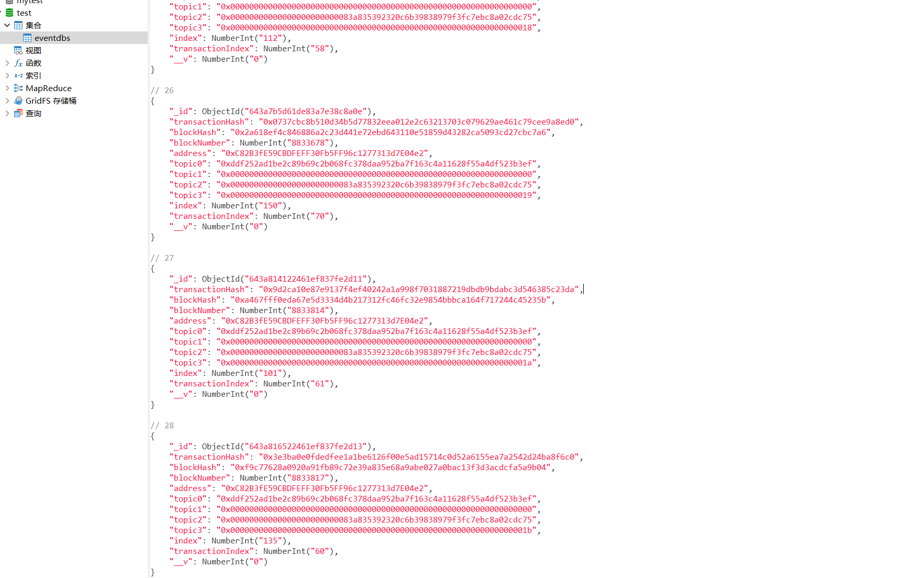

## Week4-1-2 读取链上事件

---

### 以第三周作业nft为例
* ERC721Address： 0xC82B3fE59CBDFEFF30Fb5FF96c1277313d7E04e2
* [abi](./abi/ERC721.js)

### 使用Mongodb数据库记录数据
* 

### 代码分为三部分
* 配置文件使用dotenv，在命令行运行时存在无法读取env的情况，可以写config文件；
* 代码在scripts中，分为两部分： 
    * 读取已发生事件：getEventRecordOnChain.js
    * 监听未发生事件：getEventEmitOnChain.js
* Model:dir(model)

### 
```SH
//首先运行
npm install
// 读取已发生事件
npm run eventRecord
//读取未发生事件
npm run eventEmit    
```