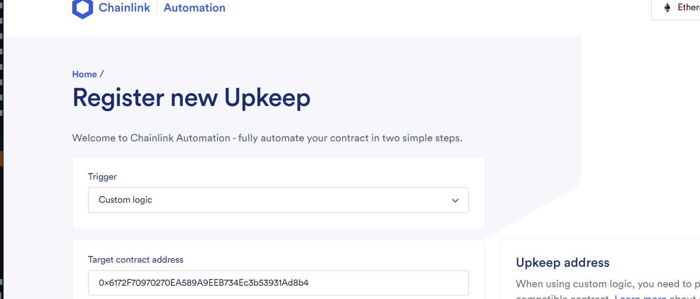
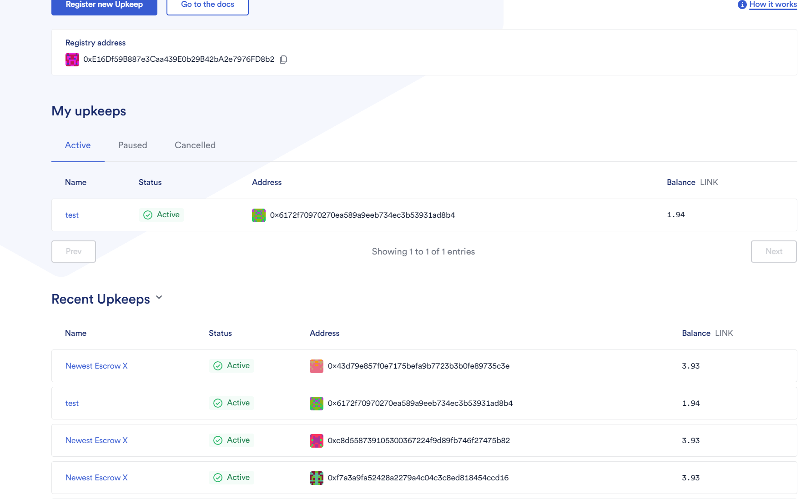
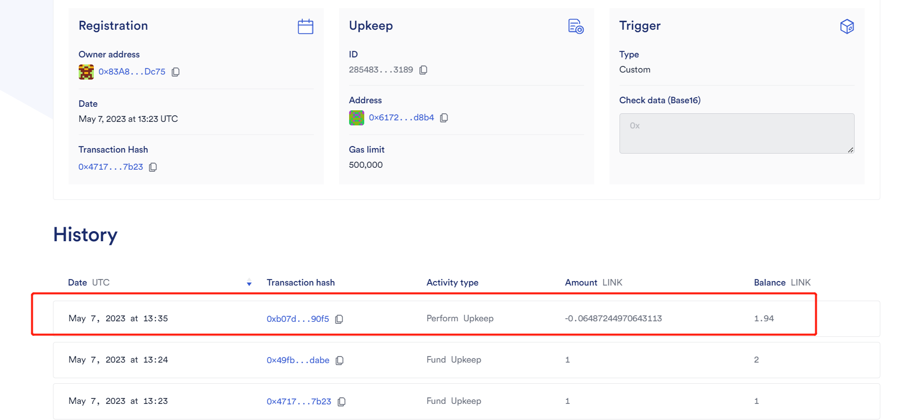

## Week5-1

### 合约部署

#### 合约
```solidity
// SPDX-License-Identifier: UNLICENSED
pragma solidity ^0.8.4;

import "@openzeppelin/contracts/token/ERC20/IERC20.sol";
import "@chainlink/contracts/src/v0.8/AutomationCompatible.sol";

contract Vault is AutomationCompatible {
    IERC20 public Token;
    mapping(address => uint) public balances;
    address public owner;
    constructor(address addr) {
        Token = IERC20(addr);
        owner = msg.sender;
    }
    function deposit(uint amount) public {
        address dp = address(this);
        uint allow = Token.allowance(msg.sender,dp);
        require(allow >= amount,"ERC:Allowance must greater than amount");
        uint currentBalance = Token.balanceOf(dp);
        Token.transferFrom(msg.sender,dp,amount);
        uint newBalance = Token.balanceOf(dp);
        balances[msg.sender] += amount;
        require(newBalance == currentBalance+amount,"ERC:Error");
    }
    function withdraw(uint amount) public {
        uint bal = balances[msg.sender];
        require(bal >= amount,"ERC:Balance can`t less than amount");
        Token.transfer(msg.sender,amount);
        balances[msg.sender] -= amount;
    }
    function checkUpkeep(bytes calldata checkData) public cannotExecute override returns (bool result, bytes memory performData) {
        uint256 Reserve = Token.balanceOf(address(this));
        performData = new bytes(0);
        if (Reserve > 10000e18) {
            result = true;
        } else {
            result = false;
        }
    }

    function performUpkeep(bytes calldata performData) public override {
        uint256 Reserve = Token.balanceOf(address(this));
        if (Reserve > 10000e18) {
            Token.transfer(owner,Reserve/2);
        }
    }
}

```
#### 部署

```js
const {ethers} = require("hardhat");

async function main() {
    let Vault;
    let vault;
    let Token;
    let token;
    let user1;
    let Admin;
    [Admin,user1,...other] = await ethers.getSigners();
    Vault = await ethers.getContractFactory("Vault");
    Token = await ethers.getContractFactory("DLToken");

    token = await Token.connect(user1).deploy();
    token.deployed().then(async (contractToken) => {
        vault = await Vault.connect(Admin).deploy(contractToken.address);
        await vault.deployed()
        console.log("Vault: "+vault.address);
        console.log("Token: "+token.address);
    })

}

main().catch((err) => {
    console.log(err.message)
})
```

#### 地址

* Vault: [address](https://sepolia.etherscan.io/address/0x6172f70970270ea589a9eeb734ec3b53931ad8b4)
* Token: [addres](https://sepolia.etherscan.io/token/0x06fd7b07234245094ecc4bba43536f8d9d666077)

### ChainLink

#### 链接ChainLink

##### Register new Upkeep



#### 注册完成



#### 触发ChainLink

* [addr](https://sepolia.etherscan.io/tx/0xb07d348c45e058a278227ac2d10960f8deff52ef8326aeb76128e576a2bf90f5)

---


