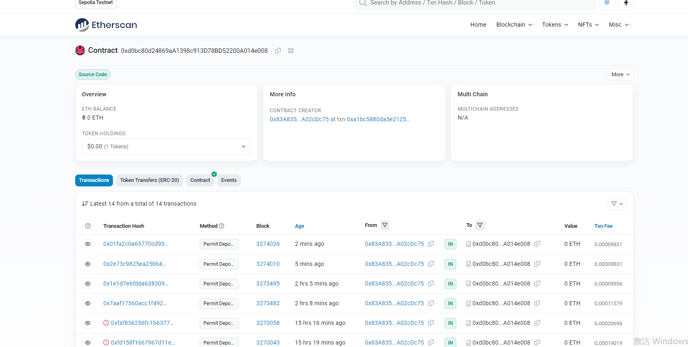
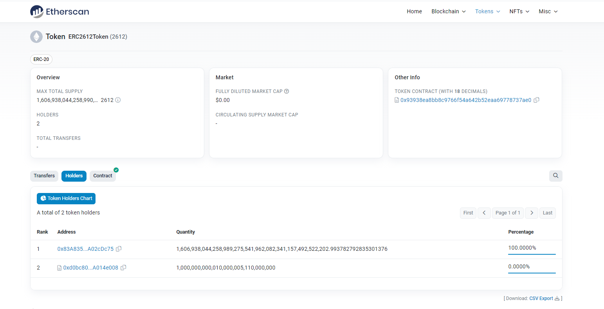
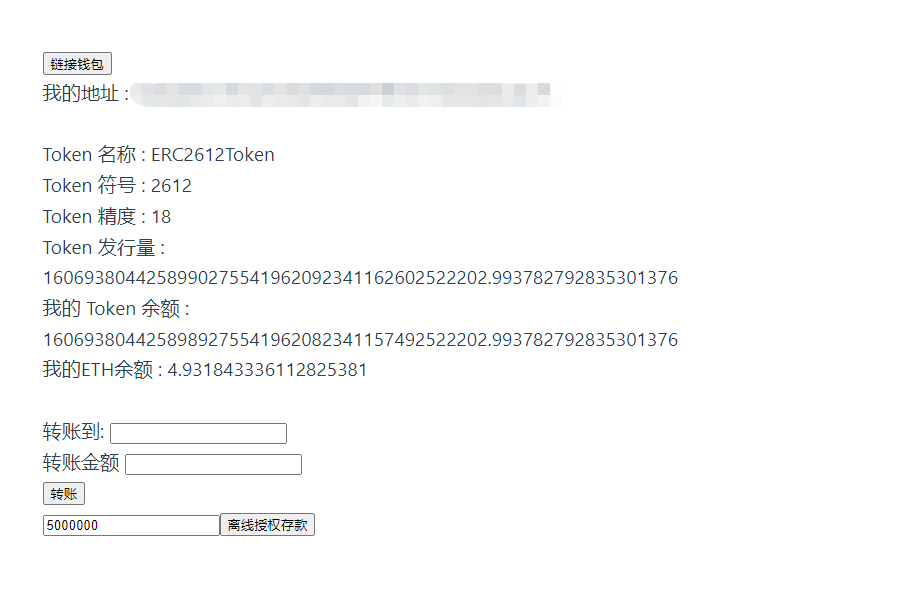

 ## 部署地址
 * [Bank](https://sepolia.etherscan.io/address/0xd0bc80d24869aa1398c913d78bd52200a014e008)
 * 
 * [ERC2612](https://sepolia.etherscan.io/token/0x93938ea8bb8c9766f54a642b52eaa69778737ae0)
 * 

 ---

 * 前端
 * 

 ---

 ## 重点

 ```js
//npm install ethers;
let provateKey = ""
//DomainSeparator
const domain = {
    name: "ERC2612Token",
    version: '1',
    chainId: chainId,
    verifyingContract: erc2612Addr.address
}
//Permit_typehash
const types = {
    Permit: [
        {name: "owner", type: "address"},
        {name: "spender", type: "address"},
        {name: "value", type: "uint256"},
        {name: "nonce", type: "uint256"},
        {name: "deadline", type: "uint256"}
        ]
}
//签名信息
const message = {
        owner: account,
        spender: bankAddr.address,
        value: amount,
        nonce: nonce,
        deadline: deadline
      }
let signer = new ethers.Wallet(provateKey);
const signature = awaitsigner._signTypedData( domain , types , value );
const {v, r, s} = ethers.utils.splitSignature(signature);
let tx = await this.bank.permitDeposit(account, amount, deadline, v, r, s);
 ```